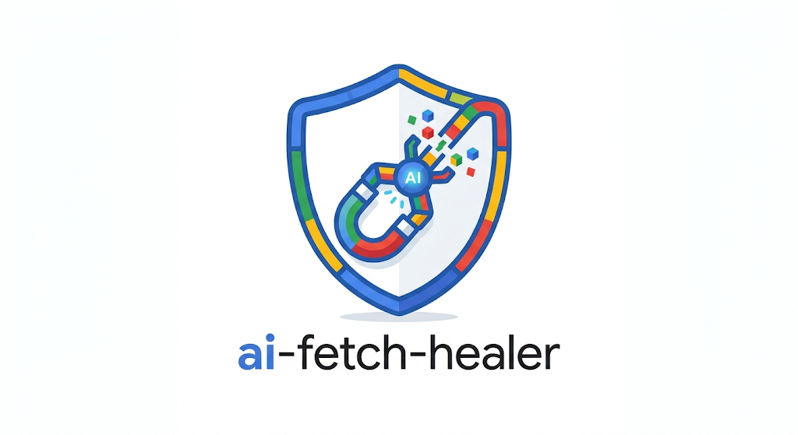

# ai-fetch-healer

<p align="center">
  
</p>

<p align="center">
  <a href="https://www.npmjs.com/package/ai-fetch-healer"></a>
  <a href="https://www.npmjs.com/package/ai-fetch-healer"></a>
  <a href="LICENSE"></a>
  <a href="https://github.com/Bannawat01/ai-fetch-healer/actions/workflows/ci.yml"></a>
  <a href="https://codecov.io/gh/Bannawat01/ai-fetch-healer"></a>
  
  
</p>

<p align="center"><strong>Your `fetch` calls, self-healing.</strong></p>

`ai-fetch-healer` is a zero-dependency `fetch` wrapper that catches schema-mismatch failures (400/422), asks an LLM for a one-line fix, applies it, and retries - automatically. Field renamed upstream? Type changed from string to number? A newly-required field? It heals the request instead of paging you.

```ts
import { createHealedFetchFromEnv } from 'ai-fetch-healer';

// Reads whichever provider key you've set (OpenRouter/Groq/Gemini/Ollama) - no provider import needed.
const healedFetch = createHealedFetchFromEnv();

// Upstream now expects `full_name`, not `user_name` - this still works.
await healedFetch('https://api.example.com/users', {
  method: 'POST',
  body: JSON.stringify({ user_name: 'Ada' }),
});
```

## Table of Contents

- [Why It Matters](#why-it-matters)
- [How It Works](#how-it-works)
- [Quick Start](#quick-start)
- [Scope & Cost](#scope--cost)
- [CLI](#cli)
- [Zero-Config Global Install](#zero-config-global-install)
- [Supported Providers](#supported-providers)
- [Framework Adapters](#framework-adapters)
- [Configuration](#configuration)
- [Persistent Rule Store](#persistent-rule-store)
- [Observability](#observability)
- [Security & Privacy (The Masker)](#security--privacy-the-masker)
- [Resilience & Timeouts](#resilience--timeouts)
- [Performance & Memory Safety](#performance--memory-safety)
- [Examples](#examples)
- [Contributing](#contributing)

## Why It Matters

Upstream APIs change. Field names drift, required keys move, and error payloads evolve. These changes often surface at the worst possible time, turning into late-night incidents and manual rollbacks.

`ai-fetch-healer` reduces those 3 AM production calls by:

- intercepting failed requests (for healing-eligible statuses, default `400`/`422`),
- generating a safe, schema-only healing rule from an LLM,
- applying the fix and retrying automatically,
- caching the rule so every later hit is a fast local lookup, not another LLM call.

The result: better uptime, fewer emergency hotfixes, and a request path that degrades gracefully instead of throwing.

## How It Works

```
  fetch() fails (400/422)
          │
          ▼
  mask payload (PII stripped, schema only)
          │
          ▼
  cache hit? ──yes──► apply cached rule ──► retry
          │no
          ▼
  ask LLM provider for a healing rule
          │
          ▼
  validate rule (untrusted output) ──invalid──► return original response
          │valid
          ▼
  cache rule + apply it + retry
```

Any failure anywhere in this path - masking, the provider call, an invalid rule - falls back to returning the **original, untouched response**. Healing is additive; it never makes a broken request more broken, and it never throws to the caller.

A healing rule is one of three actions, chosen by the LLM from the error and the masked schema:

| Action | When | Example |
| --- | --- | --- |
| `MAP_FIELDS` | A field is misnamed | `user_name` → `full_name` |
| `CHANGE_TYPE` | A field has the wrong scalar type | `age: "42"` → `age: 42` |
| `ADD_REQUIRED` | A required field is missing entirely | inject `currency: "USD"` |

## Quick Start

```bash
pnpm add ai-fetch-healer
```

Set **any one** provider key and go - no provider class to pick or import:

```env
AI_HEALER_OPENROUTER_KEY=your_key_here
```

```ts
import { createHealedFetchFromEnv } from 'ai-fetch-healer';

const healedFetch = createHealedFetchFromEnv();

const response = await healedFetch('https://api.example.com/data', {
  method: 'POST',
  body: JSON.stringify({ user_name: 'Code' }),
});
```

`createHealedFetchFromEnv()` auto-detects your provider from whichever env var is set (priority: OpenRouter → Groq → Gemini → Ollama) and throws an actionable error at startup - listing exactly which env vars it checked - if none are found. Prefer picking the provider explicitly? Use `createHealedFetch(provider)` instead:

```ts
import { createHealedFetch, OpenRouterProvider } from 'ai-fetch-healer';

const healedFetch = createHealedFetch(new OpenRouterProvider());
```

Create `healedFetch` **once** per provider (module scope, not per-request) - a fresh instance every call defeats the built-in rule cache and forces an LLM round-trip on every single request. Building an Express or Next.js route around it? See [Framework Adapters](#framework-adapters) below.

## Scope & Cost

Knowing exactly what this does - and what it costs - up front saves surprises later.

**What it heals**

- Responses whose status is in `healableStatuses` (default `[400, 422]`; configurable).
- Requests whose body is a JSON **object** sent as a string (`JSON.stringify({...})`).
- Schema-shaped problems: renamed or wrong-cased fields, wrong scalar types, a missing required field.

**What it does _not_ touch** (the original response passes straight through, untouched):

- Auth/permission errors (`401`/`403`), rate limits (`429`), server errors (`5xx`) - not schema problems, so there's nothing to heal.
- Non-JSON bodies (`FormData`, `URLSearchParams`, streams, plain strings) and `GET`/`HEAD` requests with no body.
- Anything semantic: a valid-shaped payload the API rejects for business reasons.

**What it costs**

- **Money & latency happen only on a cache miss** - the first time a given request shape fails. That one request pays an extra LLM round-trip (typically ~0.5-3s and a fraction of a cent, depending on your provider/model). The fix is then cached, so every later request of that shape is healed locally with **zero** extra calls.
- Persist the cache across restarts with a [rule store](#persistent-rule-store) so you don't re-pay after every deploy.
- Want a chunk of healing for **free**? [`HeuristicHealer`](#no-llm-healing-free-instant) fixes the most common case (field casing) with no LLM, no key, and no latency at all.

`ai-fetch-healer` is **fail-open by design**: if anything in the healing path fails - masking, the provider call, an invalid rule - it returns the original response and never throws into your code. Adding it can't make a request fail that would otherwise have succeeded.

## CLI

### `init` - scaffold a provider in one command

New to the library? Let the CLI write your `.env` line and print the snippet to paste:

```bash
npx ai-fetch-healer init --provider openrouter
```

```
ai-fetch-healer init
  ✓ Wrote AI_HEALER_OPENROUTER_KEY to .env
  Now paste your OpenRouter key after the "=" (get one at https://openrouter.ai/keys).

Add this to your code:
  import { createHealedFetchFromEnv } from "ai-fetch-healer";
  const healedFetch = createHealedFetchFromEnv();

Next: npx ai-fetch-healer doctor to verify the setup.
```

Providers: `openrouter`, `openai`, `anthropic`, `groq`, `gemini`, `ollama` (the last writes a concrete local URL, no key needed). It never overwrites a variable already in your `.env` unless you pass `--force`.

### `doctor` - preflight your setup

Before wiring healing into your app, confirm your environment is actually set up right:

```bash
npx ai-fetch-healer doctor
```

It reports which provider credentials are present (never printing a key value), which provider would be auto-selected, and then fires **one real `heal()` call** so a bad key or a dead model chain surfaces here instead of the first time a request fails in production:

```
ai-fetch-healer doctor

Credentials in environment:
  ✓ OpenAI (OPENAI_API_KEY)
  · Anthropic (AI_HEALER_ANTHROPIC_KEY / ANTHROPIC_API_KEY) - not set
  ...

Provider selection:
  ✓ Auto-selected OpenAI

Live connectivity check:
  ✓ OpenAI responded with a valid healing rule.

Setup looks healthy.
```

Exit code is `0` when healthy, `1` when something is wrong (no credentials, bad key, unreachable model) - handy in a CI preflight. Pass `--offline` to skip the live call and only inspect environment variables.

## Zero-Config Global Install

Want every `fetch` in your process healed without touching a single call site? Install healing onto the global `fetch` once, at startup:

```ts
import { installGlobalHealing } from 'ai-fetch-healer';

const uninstall = installGlobalHealing(); // reads whichever provider key is set

// From here on, every plain `fetch(...)` in the process is self-healing.
await fetch('https://api.example.com/data', { method: 'POST', body: '...' });

uninstall(); // restore the original global fetch
```

This is **opt-in and explicit** - importing the package never patches anything on its own, since replacing the global `fetch` is a process-wide side effect. Notes:

- Always call the returned `uninstall()` in tests and hot-reload paths to restore the original `fetch`.
- Calling `installGlobalHealing()` twice without uninstalling is a safe no-op - it never stacks wrappers (which would double every request).
- Accepts the same options as [`createHealedFetch`](#configuration), plus an optional `provider` to skip env auto-detection: `installGlobalHealing({ provider: new OpenRouterProvider() })`.
- Prefer an explicit `healedFetch` you pass around (`createHealedFetchFromEnv()`) when you can - global patching is the escape hatch for code you don't control the fetch calls of, not the default.

## Supported Providers

| Provider | Backend | Notes |
| --- | --- | --- |
| `OpenRouterProvider` | [OpenRouter](https://openrouter.ai) | Multi-model gateway, default `openai/gpt-4o-mini` |
| `OpenAIProvider` | [OpenAI](https://platform.openai.com) | Direct OpenAI API, default `gpt-4o-mini`; accepts a custom `baseUrl` for OpenAI-compatible gateways |
| `AnthropicProvider` | [Anthropic](https://www.anthropic.com) | Claude via the Messages API, default `claude-3-5-haiku-latest` |
| `GeminiProvider` | Google Gemini | Direct Gemini API |
| `GroqProvider` | [Groq](https://groq.com) | Fast inference, OpenAI-compatible |
| `OllamaProvider` | [Ollama](https://ollama.com) | Local/self-hosted, no API key needed by default |
| `HeuristicHealer` | none | **No LLM, no key, no cost.** Fixes field-casing mismatches (`fullName` ↔ `full_name`) with pure logic - see below |
| `FallbackProvider` | wraps others | Tries providers in order; first success wins - put `HeuristicHealer` first, an LLM second |

All LLM providers throw a typed `Error` synchronously in the constructor if no API key can be resolved (except `OllamaProvider`, which doesn't require one for a default local install). `HeuristicHealer` needs no key at all.

### No-LLM healing (free, instant)

The single most common REST schema mismatch is a field spelled with the wrong casing - `fullName` where the API wanted `full_name`, `userId` vs `user_id`. That needs no AI to fix. `HeuristicHealer` reads the field names the API names in its error, matches them against your payload keys (ignoring case and separators), and emits the rename - **zero key, zero cost, zero latency, fully deterministic**:

```ts
import { createHealedFetch, HeuristicHealer } from 'ai-fetch-healer';

// No API key anywhere. Heals casing mismatches for free.
const healedFetch = createHealedFetch(new HeuristicHealer());
```

Pair it with an LLM via `FallbackProvider` to get the best of both: common cases are fixed for free, and only the genuinely hard failures fall through to the (paid) model:

```ts
import {
  createHealedFetch,
  FallbackProvider,
  HeuristicHealer,
  OpenRouterProvider,
} from 'ai-fetch-healer';

const healedFetch = createHealedFetch(
  new FallbackProvider([
    new HeuristicHealer(),    // free: casing renames
    new OpenRouterProvider(), // paid: everything else
  ]),
);
```

`HeuristicHealer` intentionally does one thing well; when it finds no confident rename it defers (throws), so the fallback chain moves on and, used alone, the interceptor fails open to the original response.

### API key resolution

Each provider resolves its key in priority order: constructor arg → `options.apiKey` → provider-specific env var(s). For `OpenRouterProvider`:

1. `apiKey` passed to constructor
2. `options.apiKey` in constructor options
3. `AI_HEALER_OPENROUTER_KEY`
4. `OPENROUTER_API_KEY`
5. `GEMINI_API_KEY` (legacy fallback)

```env
AI_HEALER_OPENROUTER_KEY=your_openrouter_key_here
```

```ts
import { OpenRouterProvider } from 'ai-fetch-healer';

const fromEnv = new OpenRouterProvider();

const withKeyAndOptions = new OpenRouterProvider('YOUR_KEY', {
  model: 'openai/gpt-4o-mini',
  timeoutMs: 5000,
});
```

`OpenAIProvider` (`AI_HEALER_OPENAI_KEY` / `OPENAI_API_KEY`), `AnthropicProvider` (`AI_HEALER_ANTHROPIC_KEY` / `ANTHROPIC_API_KEY`), and `GroqProvider` (`AI_HEALER_GROQ_KEY` / `GROQ_API_KEY`) all follow the same pattern. `OllamaProvider` additionally accepts a configurable `baseUrl` and `model`, since there's no universal default that matches what you've pulled locally:

```ts
import { OllamaProvider } from 'ai-fetch-healer';

const provider = new OllamaProvider({
  baseUrl: 'http://localhost:11434/v1/chat/completions',
  model: 'llama3.1',
});
```

## Framework Adapters

Turn a `healedFetch` call into a ready-to-mount route handler - built in, no extra install:

```ts
// Any Web-standard Request/Response runtime: Next.js App Router, Bun, Deno, Cloudflare Workers, Remix, SvelteKit
import { createHealedFetchFromEnv, createHealedRouteHandler } from 'ai-fetch-healer';

const healedFetch = createHealedFetchFromEnv();

// app/api/orders/route.ts
export const POST = createHealedRouteHandler({
  target: 'https://upstream.example.com/v1/orders',
  healedFetch,
});
```

```ts
// Express
import { createHealedFetchFromEnv, createHealedProxyMiddleware } from 'ai-fetch-healer';

const healedFetch = createHealedFetchFromEnv();

app.post('/users', createHealedProxyMiddleware({
  target: 'https://upstream.example.com/v1/users',
  healedFetch,
}));
```

Neither adapter imports `next`/`express` - the Web adapter targets the standard global `Request`/`Response` objects, and the Express adapter is typed structurally (`ExpressLikeRequest`/`ExpressLikeResponse`), so a real Express `req`/`res` satisfies it without ai-fetch-healer ever depending on the `express` package. Zero runtime dependencies stays true even here. `target` can also be a function of the incoming request, for per-request upstream URLs.

## Configuration

`createHealedFetch(provider, config?)` accepts:

| Option | Default | Purpose |
| --- | --- | --- |
| `fetchFunction` | `globalThis.fetch` | Swap in a custom `fetch` implementation |
| `cache` | shared `HeuristicCache` | Bring your own cache instance/config |
| `store` | - | Persistent [rule store](#persistent-rule-store) (file, Redis, KV, ...). Takes precedence over `cache`. Store errors degrade to a cache miss - a broken store never breaks healing |
| `masker` | shared `Masker` | Bring your own PII-masking rules |
| `healableStatuses` | `[400, 422]` | Which response statuses trigger healing |
| `dryRun` | `false` | Audit mode: analyze the failure and report the rule via `onHeal` (`{ dryRun: true }`), but never send the healed retry. See what healing *would* do in production before it touches live traffic |
| `allowUnsafeRetry` | `true` (⚠️ changing) | Retry non-idempotent methods (`POST`/`PATCH`/...) with the healed payload. The original request already failed, so under normal conditions the retry is the only send that succeeds - set `false` only if your upstream API is known to apply partial writes even on rejected requests. **This default will flip to `false` in the next major version** (see note below) |
| `healRetries` | `2` | Retry attempts for `provider.heal()` on network/timeout failure |
| `healRetryBaseMs` | `250` | Base delay for exponential backoff between heal attempts |
| `maxErrorDetailsChars` | `4000` | Truncates the error body sent to the LLM |
| `logger` | `console` | Injectable logger, see [Observability](#observability) |
| `onHeal` | - | Callback fired when a rule is about to be applied |
| `onHealFail` | - | Callback fired when healing fails (invalid rule, exhausted retries) |

```ts
const healedFetch = createHealedFetch(provider, {
  healableStatuses: [400, 404, 422],
  healRetries: 3,
  allowUnsafeRetry: false,
});
```

> **Idempotency:** when `allowUnsafeRetry` is `true` (the default) and the upstream API supports it, send an `Idempotency-Key` header on `POST`/`PATCH` requests. A healed retry re-sends the request, so if the original had already applied a side-effect (a partial write, a charge, an email) before it was rejected, an idempotency key lets the upstream collapse the retry into the same operation instead of duplicating it.
>
> **Upcoming default change:** retrying non-idempotent `POST`/`PATCH` by default is risky, so **`allowUnsafeRetry` will default to `false` in the next major version** - healed retries of those methods will become opt-in. Until then, if you leave it unset you'll see a one-time deprecation warning the first time a non-idempotent request is healed. Pin your intent now to avoid surprises: set `allowUnsafeRetry: true` to keep healing `POST`/`PATCH` (and send an `Idempotency-Key`), or `allowUnsafeRetry: false` to adopt the safer behavior today.

## Persistent Rule Store

By default, healed rules live in an in-memory LRU cache - a restart or redeploy forgets everything and the next failing request pays the LLM round-trip again. Plug in a `RuleStore` to persist rules across restarts:

```ts
import { createHealedFetch, FileRuleStore, OpenRouterProvider } from 'ai-fetch-healer';

const healedFetch = createHealedFetch(new OpenRouterProvider(), {
  store: new FileRuleStore({ filePath: './.ai-fetch-healer-rules.json', ttlMs: 7 * 24 * 60 * 60 * 1000 }),
});
```

`FileRuleStore` (Node only) persists rules to a JSON file with atomic writes; a missing or corrupt file starts empty instead of throwing. Rules learned once keep working after every deploy.

Backing it with Redis, a database, or an edge KV takes ~10 lines - `RuleStore` is just async `get`/`set`:

```ts
import type { RuleStore } from 'ai-fetch-healer';

const redisStore: RuleStore = {
  get: async (key) => {
    const raw = await redis.get(`heal:${key}`);
    return raw ? JSON.parse(raw) : null;
  },
  set: async (key, rule) => {
    await redis.set(`heal:${key}`, JSON.stringify(rule), { EX: 60 * 60 * 24 * 7 });
  },
};
```

Only rule *shapes* are stored (keyed by method + URL + masked payload schema) - never raw payload values, so the store contains no PII by construction.

## Observability

Bring your own structured logger and hook into the healing lifecycle instead of parsing console output:

```ts
import { createHealedFetch, type HealEvent, OpenRouterProvider } from 'ai-fetch-healer';

const healedFetch = createHealedFetch(new OpenRouterProvider(), {
  logger: {
    log: (...args) => myLogger.info(args),
    warn: (...args) => myLogger.warn(args),
  },
  onHeal: (event: HealEvent) => {
    metrics.increment(`ai_fetch_healer.heal.${event.source}`); // "llm" | "cache"
  },
  onHealFail: (error) => {
    Sentry.captureException(error);
  },
});
```

See [`examples/observability.ts`](./examples/observability.ts) for a full example.

### Dry-run / audit mode

Roll healing out safely: run with `dryRun: true` first to see exactly what it *would* do without letting it mutate a single live request. The failure is analyzed and the rule is reported through `onHeal` with a `dryRun: true` flag, but the healed retry is never sent - the caller gets the original response untouched.

```ts
const healedFetch = createHealedFetch(new OpenRouterProvider(), {
  dryRun: true,
  onHeal: (event) => {
    if (event.dryRun) {
      logger.info('would heal', { source: event.source, rule: event.rule });
    }
  },
});
```

Watch the logs for a while; once the proposed rules look right, drop `dryRun` and healing goes live.

## Security & Privacy (The Masker)

`ai-fetch-healer` masks payloads before any healing analysis: every value is recursively reduced to its type name (or a category label for sensitive keys), so no real value is ever sent to an LLM provider. See [What the masker does and does not send](#what-the-masker-does-and-does-not-send) for the exact boundary.

### Sensitive key defaults

| Category | Default Sensitive Keys | Example Mask Output |
| --- | --- | --- |
| Identity | `email`, `phone`, `username` | `masked_email`, `masked_phone`, `masked_identity` |
| Credentials | `password`, `token`, `api_key` | `masked_password`, `masked_token` |
| Financial | `credit_card`, `bank_account` | `masked_credit_card`, `masked_financial` |

Key matching is case-insensitive and separator-agnostic (`User-Email`, `USER_PASSWORD`, etc. are all caught).

### What the masker does and does not send

Every value in the payload is reduced to its type name (`"string"`, `"number"`, ...) before anything is sent to an LLM - a value that matches a sensitive key becomes a category label like `masked_email` instead, and either way no raw value leaves the masker.

The one thing that *is* sent is the set of object **keys**, unchanged, as the schema shape the healer reasons about (that is how it can propose a field rename). So a key whose name itself contains personal data - which is rare, but possible - would be transmitted to the provider. If your payloads can carry PII inside key names, mask or rename those keys before they reach `healedFetch`.

### Custom masker for enterprise fields

```ts
import { createHealedFetch, Masker, OpenRouterProvider } from 'ai-fetch-healer';

const customMasker = new Masker({
  additionalSensitiveKeys: ['customer_id', 'internal_secret'],
  maskingString: '[PROTECTED_DATA]',
});

const healedFetch = createHealedFetch(new OpenRouterProvider(), { masker: customMasker });
```

## Resilience & Timeouts

`ai-fetch-healer` uses an `AbortController`-based timeout strategy to prevent hanging provider calls.

- Default timeout: `10000ms` (10 seconds), configurable per provider via `timeoutMs`
- On timeout: healing is aborted and the original API response is returned - availability over completeness
- `provider.heal()` failures (network blips, timeouts) get retried with exponential backoff (`healRetries`/`healRetryBaseMs`) before falling back

```ts
const provider = new OpenRouterProvider('YOUR_KEY', { timeoutMs: 5000 });
```

## Performance & Memory Safety

`HeuristicCache` avoids repeated LLM calls for requests that fail the same way:

- Lookup: `O(1)` map-based key access
- Bounded capacity: 1,000 entries by default, true LRU eviction (`get()` bumps recency, not just insertion order)
- Optional TTL per entry, so stale rules don't outlive an upstream fix

```ts
import { HeuristicCache } from 'ai-fetch-healer';

const cache = new HeuristicCache({ maxEntries: 500, ttlMs: 1000 * 60 * 60 }); // 1 hour
const healedFetch = createHealedFetch(provider, { cache });
```

The `Masker` and `HeuristicCache` code paths run on every healable-status response - including cache hits, since masking has to happen before a cache key can even be generated - so both are kept allocation-light. Run `pnpm bench` to benchmark them on your own machine (`benchmarks/`, via vitest's built-in bench runner); numbers aren't published here since they're hardware-dependent and this repo doesn't want to make a claim it can't keep current. What actually dominates request latency in practice is the upstream API + LLM provider round-trip, not this library's own overhead.

## Examples

The [`examples/`](./examples) directory has standalone snippets for real integration paths: a minimal Node script, an Express proxy route, a Next.js App Router handler, and the observability wiring shown above.

[](https://stackblitz.com/github/Bannawat01/ai-fetch-healer)

That opens this repo in an editable in-browser IDE - useful for browsing/tweaking the source and the `examples/` snippets without cloning locally. It's not a hosted one-click demo: every example still needs your own LLM provider key (see [Quick Start](#quick-start)) to actually call `healedFetch`, since there's no shared API key to hand out.

## Contributing

See [CONTRIBUTING.md](./CONTRIBUTING.md) for the dev setup, PR checklist, and a guide to adding a new LLM provider.
